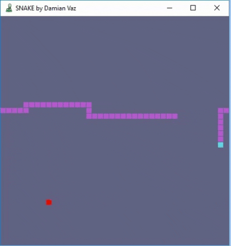

# Snake Game

[](https://damianvaz.com)

The classic Snake game made with Java and JavaFx
<p align="center">
  
</p>

## Getting Started

Download SnakeGame.jar file.<br/>
Or if you want an .exe download the Snaky.exe<br/>
Snake.exe is a exe wrapper made with JSmooth, please note that you still need a JRE 1.8 or higher;

### Prerequisites

Java Runtime Environment 8 or higher: 
<a href="https://www.oracle.com/technetwork/java/javase/downloads/jre8-downloads-2133155.html">Download here</a>


```
until finished
```


## Built With

* [Java](https://www.oracle.com/technetwork/java/javase/overview/java8-2100321.html) - Java 8
* [JavaFx](https://openjfx.io) - GUI client platfrom

## Authors

* **Damian Vaz** - *Initial work* - [DamianVaz](https://github.com/DamianVaz)

## License

This project is licensed under the GNU General Public License v3.0 - see the [LICENSE.md](LICENSE.md) file for details

## Acknowledgments

* <div>Icons made by <a href="https://www.freepik.com/?__hstc=57440181.faddc5f989977108ee495b1dcf6ee2a0.1563315575728.1563315575728.1563330439162.2&__hssc=57440181.3.1563330439162&__hsfp=2211470172" title="Freepik">Freepik</a> from <a href="https://www.flaticon.com/"                 title="Flaticon">www.flaticon.com</a> is licensed by <a href="http://creativecommons.org/licenses/by/3.0/"                 title="Creative Commons BY 3.0" target="_blank">CC 3.0 BY</a></div>

